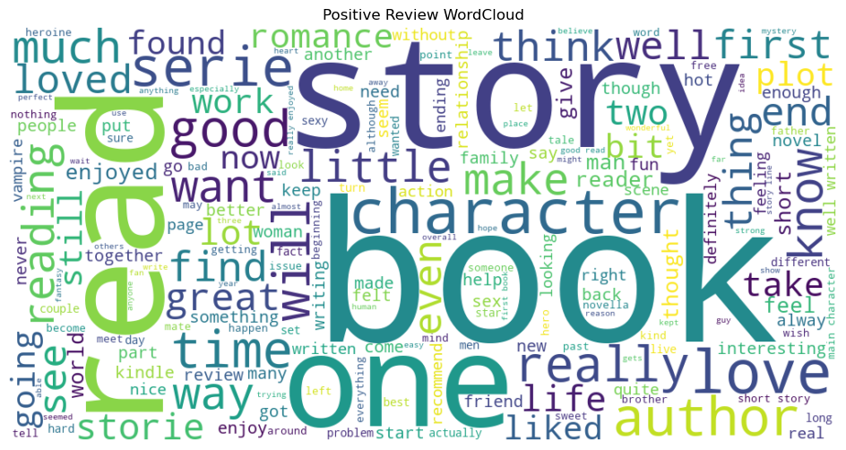
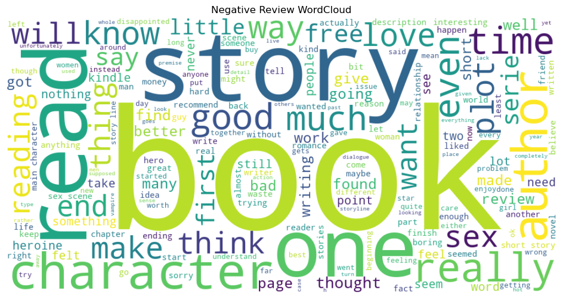

# Kindle Review Sentiment Analysis

An NLP-based sentiment analysis project that classifies Kindle product reviews using multiple text vectorization techniques and machine learning models.

## Overview

This project explores Natural Language Processing (NLP) workflows for sentiment classification using Kindle review datasets. Different text embedding approaches such as:

* Bag of Words (BoW)
* TF-IDF
* Word2Vec

were implemented and compared to understand their impact on model performance.

The project focuses on:

* Text preprocessing
* Feature extraction
* Vectorization techniques
* Model training and evaluation
* Sentiment prediction

---

## Dataset

The dataset consists of Kindle product reviews with corresponding sentiment labels.

Example tasks:

* Positive/Negative sentiment classification
* Review preprocessing and cleaning
* Tokenization and vectorization

---

## Technologies Used

* Python
* Pandas
* NumPy
* Scikit-learn
* NLTK
* Gensim
* Matplotlib
* Jupyter Notebook

---

## NLP Techniques Implemented

### 1. Text Preprocessing

* Lowercasing
* Stopword removal
* Tokenization
* Stemming/Lemmatization
* Punctuation removal

### 2. Vectorization Methods

* Bag of Words (BoW)
* TF-IDF Vectorization
* Word2Vec Embeddings

### 3. Machine Learning Models

* Naive Bayes
* Logistic Regression
* Random Forest (if implemented)

---

## Project Structure

```bash
├── experiments.ipynb
├── sentiment analysis.ipynb
├── all_kindle_review.csv
├── requirements.txt
└── README.md
```

---

## Installation

Clone the repository:

```bash
git clone https://github.com/your-username/Kindle-Review-Sentiment-Analysis.git
```

Install dependencies:

```bash
pip install -r requirements.txt
```

Run the notebooks using Jupyter Notebook or VS Code.

---

## Results

The project compares different NLP embedding methods and evaluates their effectiveness for sentiment analysis tasks.

Evaluation metrics explored:

* Accuracy
* Confusion Matrix
* Classification Report

---

## Model Comparison

| Model | Embedding | Accuracy | Precision (0) | Recall (0) | F1 (0) | Precision (1) | Recall (1) | F1 (1) |
|-------|-----------|----------|---------------|------------|--------|---------------|------------|--------|
| Logistic Regression | TF-IDF | 84.75% | 0.67 | 0.84 | 0.74 | 0.94 | 0.85 | 0.89 |
| Logistic Regression | BoW | 83.88% | 0.72 | 0.77 | 0.75 | 0.90 | 0.87 | 0.88 |
| Naive Bayes | TF-IDF | 60.33% | 0.45 | 0.80 | 0.57 | 0.84 | 0.51 | 0.63 |
| Naive Bayes | BoW | 59.42% | 0.80 | 0.45 | 0.57 | 0.51 | 0.84 | 0.63 |
| Logistic Regression | Word2Vec | 60.77% | 0.66 | 0.58 | 0.62 | 0.56 | 0.64 | 0.59 |
| Random Forest | Word2Vec | 60.87% | 0.66 | 0.59 | 0.62 | 0.56 | 0.64 | 0.60 |

---

###



Most used vocabulary for positive reviews



Most used vocabulary for negative reviews

---

## Future Improvements

* Deep Learning models (LSTM/BERT)
* Deployment using Streamlit
* Real-time sentiment prediction
* Hyperparameter tuning
* Model comparison dashboard

---

## Learning Outcomes

Through this project, I explored:

* End-to-end NLP workflows
* Text vectorization techniques
* Machine learning model training
* Data preprocessing pipelines
* Model evaluation strategies

---